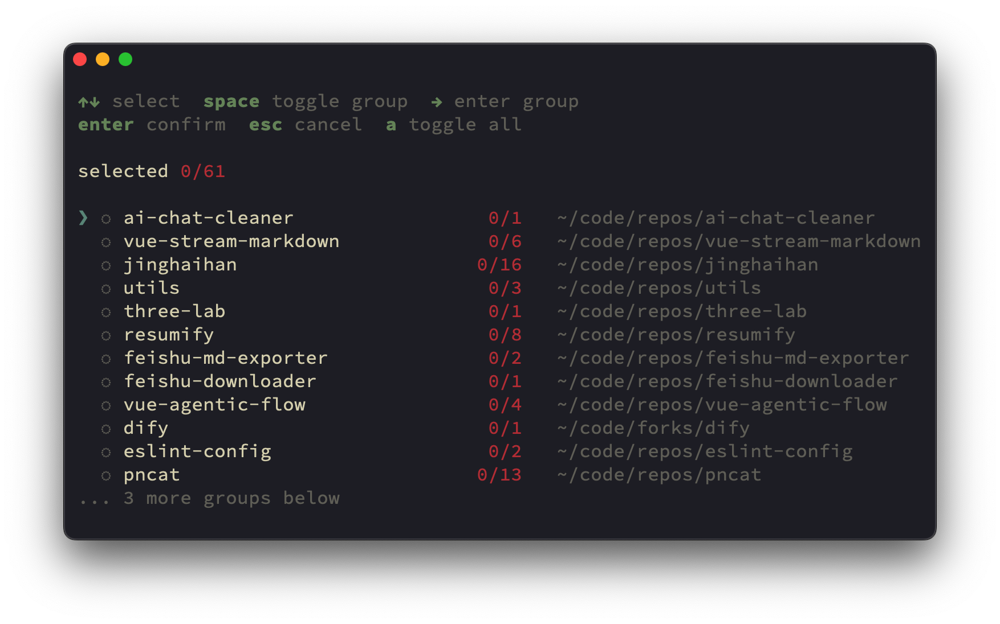

# ai-chat-cleaner

[![npm version][npm-version-src]][npm-version-href]
[![bundle][bundle-src]][bundle-href]
[![JSDocs][jsdocs-src]][jsdocs-href]
[![License][license-src]][license-href]

Clean and remove AI chat with an interactive terminal UI.

```sh
npx ai-chat-cleaner
```

> [!WARNING]
> Please restart your AI coding tool after deletion.
>
> It is recommended to clean history while Codex is not running, to avoid duplicate writes.

<p align='center'>

</p>

- Supported agents:
  - `codex`

## Why ?

I am not entirely sure why `Codex` and `Claude Code` do not provide a way to delete a specific conversation history, perhaps to preserve context continuity.

But in practice, one conversation that goes in the wrong direction can keep affecting later outputs, so I built this tool.

## Credit

The terminal interaction mode is inspired by [taze](https://github.com/antfu-collective/taze).

## License

[MIT](./LICENSE) License © [jinghaihan](https://github.com/jinghaihan)

<!-- Badges -->

[npm-version-src]: https://img.shields.io/npm/v/ai-chat-cleaner?style=flat&colorA=080f12&colorB=1fa669
[npm-version-href]: https://npmjs.com/package/ai-chat-cleaner
[npm-downloads-src]: https://img.shields.io/npm/dm/ai-chat-cleaner?style=flat&colorA=080f12&colorB=1fa669
[npm-downloads-href]: https://npmjs.com/package/ai-chat-cleaner
[bundle-src]: https://img.shields.io/bundlephobia/minzip/ai-chat-cleaner?style=flat&colorA=080f12&colorB=1fa669&label=minzip
[bundle-href]: https://bundlephobia.com/result?p=ai-chat-cleaner
[license-src]: https://img.shields.io/badge/license-MIT-blue.svg?style=flat&colorA=080f12&colorB=1fa669
[license-href]: https://github.com/jinghaihan/ai-chat-cleaner/LICENSE
[jsdocs-src]: https://img.shields.io/badge/jsdocs-reference-080f12?style=flat&colorA=080f12&colorB=1fa669
[jsdocs-href]: https://www.jsdocs.io/package/ai-chat-cleaner
