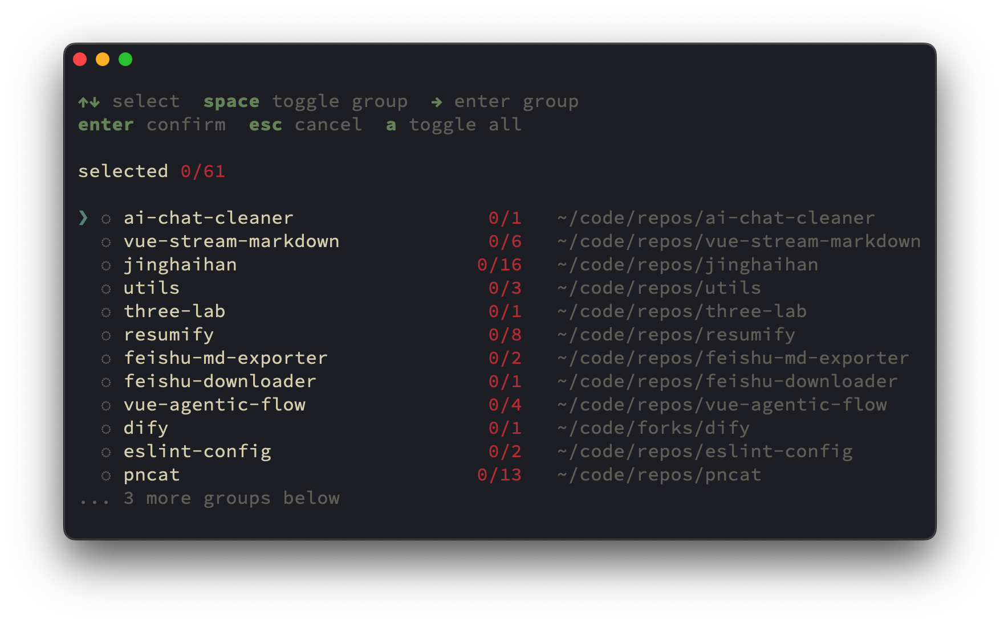

# ai-chat-cleaner

[![npm version][npm-version-src]][npm-version-href]
[![bundle][bundle-src]][bundle-href]
[![JSDocs][jsdocs-src]][jsdocs-href]
[![License][license-src]][license-href]

Clean and remove AI chat with an interactive terminal UI.

```sh
npx ai-chat-cleaner
npx ai-chat-cleaner --agent codex
```

- Supported agents:
  - Codex (`codex`)
  - Claude Code (`claude-code`)

> [!WARNING]
> Please restart your AI coding tool after deletion.
>
> It is recommended to clean history while Codex is not running, to avoid concurrent writes.

<p align='center'>

</p>

## Codex cleanup

Codex conversations are deleted through the official `codex delete --force` command. The CLI keeps the existing interactive selection UI, but no longer edits Codex SQLite or JSONL files directly.

The command is resolved in this order:

- `AI_CHAT_CLEANER_CODEX_BIN`, when set
- The Codex binary bundled with the macOS ChatGPT/Codex desktop app
- `codex` on `PATH`

The selected executable must support `codex delete --force`. Update the Codex desktop app or install the Codex CLI if no compatible executable is found.

This is a **local cleanup**: it removes the Codex session from this computer. It does not delete the conversation from your ChatGPT account.

## Delete Codex chats from your ChatGPT account

To delete a Codex chat from your account, use the official ChatGPT desktop app flow:

1. Archive the chat from the Codex history sidebar.
2. Open **Settings** → **Archived chats**.
3. Delete the archived chat.

OpenAI schedules deleted chats for permanent deletion from its systems within 30 days, subject to its stated exceptions. See [How to archive and delete Codex chats in the ChatGPT app](https://help.openai.com/en/articles/20001333-how-to-archive-and-delete-chats-in-codex).

## Credit

The terminal interaction mode is inspired by [taze](https://github.com/antfu-collective/taze).

Claude Code cleanup implementation references [claude-chats-delete](https://github.com/ataleckij/claude-chats-delete).

## License

[MIT](./LICENSE) License © [jinghaihan](https://github.com/jinghaihan)

<!-- Badges -->

[npm-version-src]: https://img.shields.io/npm/v/ai-chat-cleaner?style=flat&colorA=080f12&colorB=1fa669
[npm-version-href]: https://npmjs.com/package/ai-chat-cleaner
[npm-downloads-src]: https://img.shields.io/npm/dm/ai-chat-cleaner?style=flat&colorA=080f12&colorB=1fa669
[npm-downloads-href]: https://npmjs.com/package/ai-chat-cleaner
[bundle-src]: https://img.shields.io/bundlephobia/minzip/ai-chat-cleaner?style=flat&colorA=080f12&colorB=1fa669&label=minzip
[bundle-href]: https://bundlephobia.com/result?p=ai-chat-cleaner
[license-src]: https://img.shields.io/badge/license-MIT-blue.svg?style=flat&colorA=080f12&colorB=1fa669
[license-href]: https://github.com/jinghaihan/ai-chat-cleaner/LICENSE
[jsdocs-src]: https://img.shields.io/badge/jsdocs-reference-080f12?style=flat&colorA=080f12&colorB=1fa669
[jsdocs-href]: https://www.jsdocs.io/package/ai-chat-cleaner
